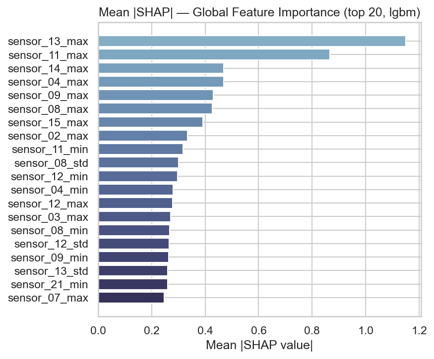

# Predictive Maintenance — Turbofan Engine Health Classification

Multi-class health classification on the NASA C-MAPSS turbofan engine dataset,
demonstrating an end-to-end MLOps pipeline from raw sensor data to a containerised
inference API with automated model selection and experiment tracking.

---

## Problem Statement

Predict the current health state of a jet engine from its sensor history, enabling
maintenance teams to intervene before catastrophic failure.

**Health classes** (derived from Remaining Useful Life):

| Class | RUL range | Meaning |
|---|---|---|
| Healthy (0) | > 80 cycles | Normal operation |
| Degrading (1) | 31 – 80 cycles | Early-warning window |
| Critical (2) | ≤ 30 cycles | Urgent maintenance required |

---

## Dataset

**NASA C-MAPSS** (Commercial Modular Aero-Propulsion System Simulation)
Source: [Kaggle — behrad3d/nasa-cmaps](https://www.kaggle.com/datasets/behrad3d/nasa-cmaps)

- 4 sub-datasets (FD001–FD004): varying operating conditions and fault modes
- 21 sensor channels + 3 operational settings per cycle
- Full run-to-failure trajectories for each engine unit

Dataset is downloaded automatically via `kagglehub` on first run.

---

## Project Structure

```
predictive-maintenance-rul/
├── PredictiveMaintenance_Training.ipynb   # Main notebook (full pipeline)
├── requirements.txt                       # Full training dependencies
├── requirements-inference.txt             # Minimal inference-only dependencies
├── Dockerfile                             # Container for inference API
├── docker-compose.yml                     # Compose config (port 8001)
├── assets/                                # Exported figures
├── data/
│   └── raw/                               # Local data cache (gitignored — auto-downloaded)
├── mlruns/                                # MLflow experiment tracking & model registry
├── models/                                # Saved artefacts (gitignored — regenerate via notebook)
│   ├── scale_params.json                  # Min-max scale parameters for raw-data inference
│   └── lstm_model.keras                   # Optional LSTM checkpoint
└── utils/
    ├── data_loader.py                     # C-MAPSS loader + RUL computation
    ├── download_dataset.py                # kagglehub download helper
    ├── feature_engineering.py             # Rolling-window feature engineering
    ├── ml_classification.py               # FLAML AutoML + LSTM wrappers, evaluation
    ├── inference_api.py                   # FastAPI inference service
    └── plot_style.py                      # Global plot theme and colour palettes
```

---

## Pipeline Overview

```
Data Acquisition → EDA → Preprocessing → AutoML → Evaluation → Explainability → Deployment
```

| Section | What happens |
|---|---|
| 1. Data Acquisition | Download C-MAPSS via kagglehub; load FD001–FD004 |
| 2. EDA | Class distribution, sensor trends, correlation heatmap |
| 3. Preprocessing | RUL labelling, 30-cycle rolling features, min-max normalisation |
| 4. Model Definition | FLAML AutoML configuration; LSTM sequence model |
| 5. AutoML & Model Selection | FLAML searches LightGBM / XGBoost / RF / linear models; best run logged to MLflow |
| 6. Evaluation | Test-set metrics (accuracy, F1-macro, F1-weighted) |
| 7. Visualisations | Confusion matrices, feature importance, LSTM training curves |
| 8. Explainability | SHAP TreeExplainer — beeswarm + global bar chart |
| 9. Summary | Key findings and limitations |

---

## Models

### FLAML AutoML (primary)
- Searches over LightGBM, XGBoost, Random Forest, Extra Trees, and linear models
- Optimises F1-weighted using a cost-frugal Bayesian search strategy
- Best model and hyperparameters registered automatically in MLflow Model Registry
- Input: flat rolling-feature vector (73 features per cycle window)

### LSTM (optional — requires TensorFlow)
- Input: sensor sequences `(30 cycles × 14 sensors)`
- 2-layer LSTM (128 → 64 units) with dropout, early stopping, and class-weighted training
- Captures temporal degradation patterns end-to-end

---

## Key Results

| Model | CV F1-weighted | Test F1-weighted | Test F1-macro | Test Accuracy |
|---|---|---|---|---|
| **FLAML AutoML (LightGBM)** | — | **0.9877** | **0.9821** | **0.9877** |
| XGBoost (baseline) | 0.9542 ± 0.0016 | 0.9571 | 0.9442 | 0.9577 |
| LSTM | — | 0.8784 | 0.8620 | 0.8795 |

FLAML selected LightGBM as the best estimator, outperforming the manual XGBoost
baseline by +3.1 pp F1-weighted with no hand-tuning required.

---

## Explainability

SHAP values identify the most predictive features for the **Critical** class:

- `sensor_14_mean` / `sensor_14_std` — core speed tracks late-stage degradation
- `sensor_11_mean` — HPC static pressure rises with compressor fouling
- `norm_cycle` — temporal progress is independently predictive
- `sensor_04_delta` — rate-of-change in LPT outlet temperature



---

## MLflow Experiment Tracking

All training runs are logged to the local MLflow Model Registry under the
experiment `turbofan-health-classification`.

```bash
# Launch the MLflow UI from the project root
python -m mlflow ui
# Open http://127.0.0.1:5000
```

Each run records:
- All Section 0 constants (window size, RUL thresholds, test split, etc.)
- FLAML search configuration (time budget, metric)
- Best estimator name and hyperparameters
- CV F1-weighted, test accuracy, test F1-macro, test F1-weighted
- Trained model artifact with input/output schema

---

## Inference API

### Local (no Docker)

```bash
uvicorn utils.inference_api:app --reload --port 8000
# Swagger UI → http://localhost:8000/docs
```

### Docker (recommended)

```bash
docker compose up --build
# Swagger UI → http://localhost:8001/docs
```

### Endpoints

| Method | Endpoint | Input | Description |
|---|---|---|---|
| GET | `/health` | — | Liveness probe + model metadata |
| POST | `/predict` | Pre-extracted feature vectors | Batch tabular inference |
| POST | `/predict_raw` | Raw cycle sensor readings | Full pipeline server-side |

**`/predict_raw` example** — send raw sensor readings, get health label back:

```bash
curl -X POST http://localhost:8001/predict_raw \
  -H "Content-Type: application/json" \
  -d '{
    "unit_id": 1,
    "cycles": [{
      "op_setting_1": 0.0, "op_setting_2": 0.0, "op_setting_3": 100.0,
      "sensor_02": 641.8, "sensor_03": 1589.7, "sensor_04": 1400.6,
      "sensor_07": 554.4, "sensor_08": 2388.0, "sensor_09": 9046.2,
      "sensor_11": 47.5,  "sensor_12": 521.7,  "sensor_13": 2388.1,
      "sensor_14": 8138.6,"sensor_15": 8.4195, "sensor_17": 392.0,
      "sensor_20": 38.8,  "sensor_21": 23.4
    }]
  }'
# → {"labels": ["Healthy"], "predictions": [0], "probabilities": [[0.91, 0.07, 0.02]], ...}
```

The `mlruns/` and `models/` directories are **mounted as read-only volumes** — not
baked into the image. Retraining on the host and running `docker compose restart`
is all that is needed to deploy a new model version.

---

## CI/CD Design

The training pipeline is designed for CI/CD integration via GitHub Actions.
On each merge to `main`, the notebook can be executed automatically, the new
model version registered to MLflow, and the container restarted to serve the
updated model — decoupling training from deployment.

```
git push → GitHub Actions → jupyter nbconvert --execute → MLflow register → docker compose restart
```

---

## Setup

**Requirements:** Python 3.11, pip

```bash
pip install -r requirements.txt
```

**Kaggle API token** — required for automatic dataset download:

```bash
# Place kaggle.json in your home directory (Kaggle → Settings → API → New Token)
# Windows (PowerShell)
mkdir $env:USERPROFILE\.kaggle
Copy-Item kaggle.json $env:USERPROFILE\.kaggle\
```

**Run the notebook:**

```bash
jupyter lab PredictiveMaintenance_Training.ipynb
```

---

## Limitations & Next Steps

- Health-class thresholds (RUL 80/30) are heuristic; cost-sensitive optimisation
  could align them with actual maintenance economics
- FD002/FD004 (6 operating conditions) are harder sub-tasks; clustering operating
  regimes before classification may improve performance
- Transformer-based sequence models (e.g. TST) may outperform LSTM with less tuning
- A shared MLflow tracking server would unify experiment history across multiple
  portfolio projects
